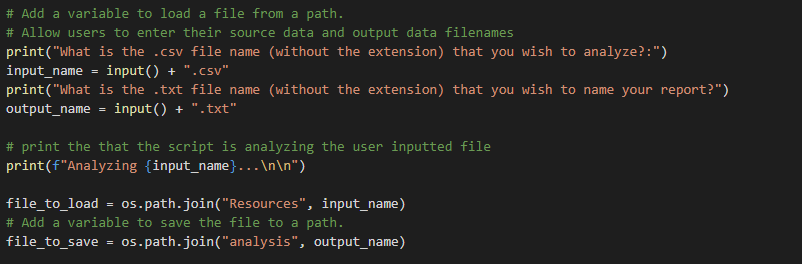
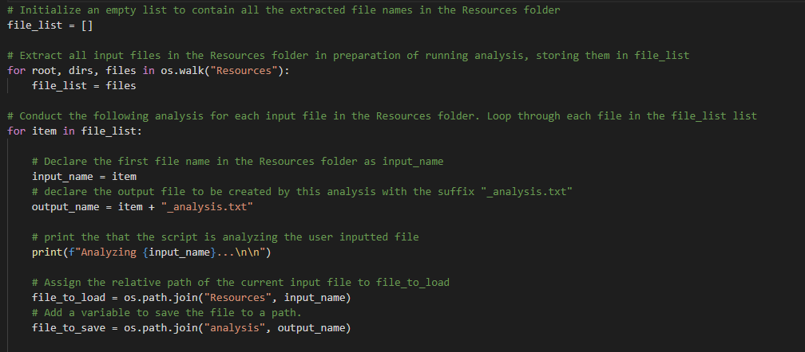

# Election Analysis

## Project Overview

This project analyzes a fictional dataset containing congressional election data from the state of Colorado. At a glance, the project had five objectives overall:
1. Calculate the total number of votes cast across all counties described
2. Obtain a list of all the candidates who ran in this election
3. Calculate the total number of votes each candidate received
4. Calculate the percentage of the total votes that each candidate received
5. Determine the winner of the election and output it to a formatted report file

## Resources

Source Data: election_results.csv
Software: Python 3.9.1, Visual Studio Code, 1.52.1

## Summary of results

After analyzing the dataset, we can conclude the following:

* There were 369,711 votes cast in the election

* The three candidates who ran were:

  * Charles Casper Stockham
	 
  * Diana DeGette
	 
  * Raymon Anthony Doane
	 
* Charles Casper Stockham received 23% of the votes (n=85,213)

* Diana DeGette received 73.8% of the votes (n=272,892)
	 
* Raymon Anthony Doane received 3.1% of the votes (n=11,606)
	 
* As a result, Diana DeGette won by a large majority, receiving 272,892 votes.

## Scalability and recommendations for future use

* One option to give users more flexibility to reuse code is to allow users to input the file name and output file names, by using the `input()` function and some string concatenation. By assigning `input_name = input() + ".csv` and `output_name = input() + ".txt"` we can allow the user to analyze multiple .csv files and output them to different reports, enhancing the scalability of this code. See below for an example of this:

* Going one step further, I've refactored the code to be able to accept multiple input files stored in the Resources folder. `os.walk()` looks through all files in the specified folder `"Resources"` and extracts all file names in it, storing the names to `file_list`. We can then loop through each file name and use it as an input as seen below. Each CSV file's analysis is given a unique name with suffix `"_analysis.txt"`. In practical terms, one could have multiple states' or provinces' election data stored in the `"Resources"` folder and this script would now loop through all of them and produce a unique output file for each analysis run. 

Refactored code is as follows:

